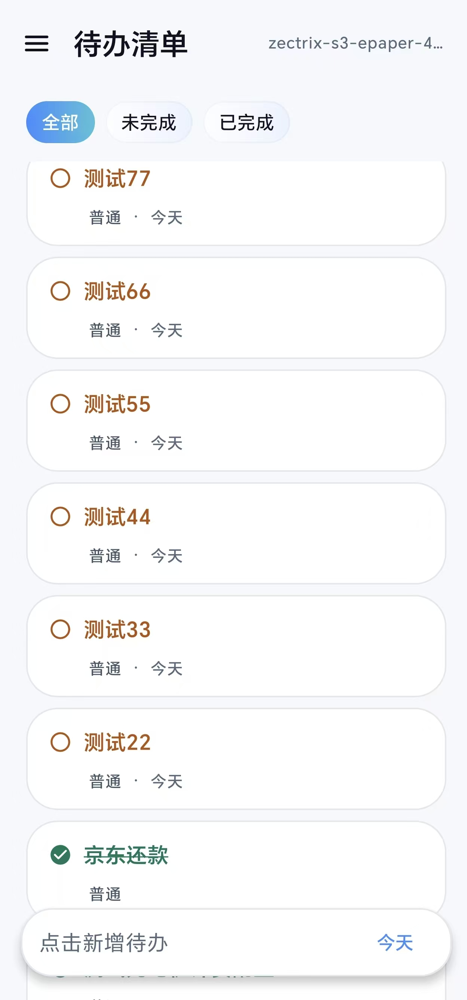
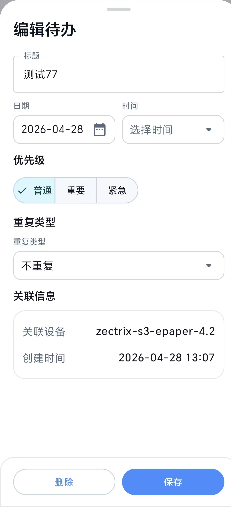
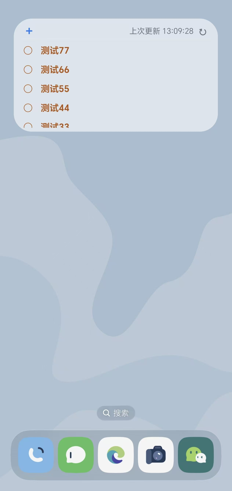
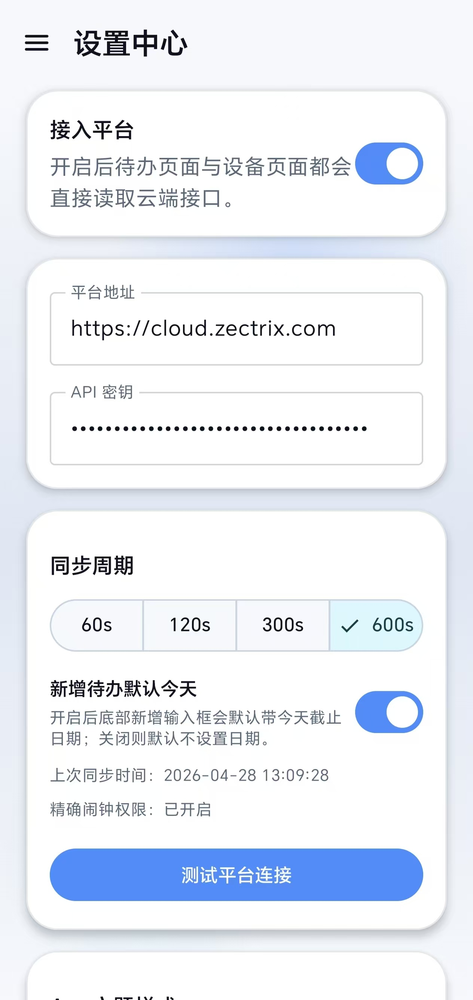

# android_sticky_note

android_sticky_note是一个面向 Android 的待办管理工具，配合 Zectrix 墨水屏设备与极趣云平台使用。它提供手机端待办管理、桌面小组件和云端同步能力，让待办可以在 App、小组件与墨水屏设备之间形成轻量联动。

> 本项目由 PASSHEEP 提出需求、测试与验收，主要通过 Codex + GPT-5.4 协作开发完成。

## 项目预览

| App 首页                     | 编辑页面 |
|----------------------------| --- |
|  |  |

| 桌面小组件 | 设置页面 |
| --- | --- |
|  |  |

## 项目说明

本项目不是独立离线待办应用，需要关联极趣云平台和墨水屏设备使用。App 通过极趣云平台 Open API 获取设备与待办数据，并将用户在 App 或桌面小组件上的操作同步到平台。

适用场景：

- 在 Android 手机上管理 Zectrix 极趣 Note 4 相关待办。
- 在桌面小组件中快速查看、刷新和勾选待办。
- 通过极趣云平台 API 与墨水屏设备保持数据联动。

## 获取 API Key

1. 访问 https://cloud.zectrix.com/home/api-keys 创建 API Key。
2. 在 App「设置中心」页面开启接入平台。
3. 填写平台地址，例如 `https://cloud.zectrix.com`。
4. 添加 API Key。
5. 点击测试平台连接，并选择需要关联的设备。
6. 若出现同步不及时的情况，请开启“精确闹钟权限”、关闭电池优化、允许后台运行。

## 已完成功能

- 待办清单：新增、编辑、删除、完成/取消完成。
- 云端同步：通过极趣云平台 Open API 拉取与更新待办。
- 设备关联：拉取设备列表，并按设备绑定待办数据。
- 桌面小组件：展示待办列表、滚动列表、手动刷新、勾选完成等。
- 小组件样式：支持浅色/深色/跟随系统、透明度。
- 后台刷新：基于 `AlarmManager`、`WorkManager` 和系统广播进行定期刷新。
- 同步周期：支持 60s、120s、300s、600s。

## 待完成功能

- 某些情况下杀掉后台出现同步延时或时效。
- 图片推送到墨水屏设备。
- 闹钟提醒与系统通知。
- 更完整的重复任务管理。
- 多设备之间更细粒度的冲突处理。
- 小组件更多尺寸与更多样式适配。

## 技术栈

- 语言：Kotlin
- UI：Jetpack Compose、Material 3
- 架构：MVVM + 分层数据模块
- 依赖注入：Hilt
- 网络：Retrofit、OkHttp、Kotlinx Serialization
- 配置存储：DataStore Preferences
- 本地数据库：Room
- 后台任务：WorkManager、AlarmManager
- 小组件：Android AppWidgetProvider、RemoteViews、RemoteViewsService

## 项目架构

```text
app/src/main/java/com/passheep/sticky_note
├── core
│   ├── model          # Todo、Device、同步状态等领域模型
│   ├── repository     # 仓库接口
│   └── settings       # 应用配置模型与接口
├── data
│   ├── cloud          # 云端待办状态容器
│   ├── local          # Room 数据库、DAO、Entity
│   ├── network        # Retrofit/OkHttp 网络配置
│   ├── remote         # API Service、DTO、远端映射
│   ├── settings       # DataStore 配置持久化
│   └── sync           # 后台同步、闹钟调度、启动恢复
├── feature
│   └── app            # Compose 主界面、设置页、关于页
├── ui
│   └── theme          # 应用主题
└── widget             # 桌面小组件、RemoteViews 渲染、点击行为
```

当前版本的小组件会通过平台接口获取最新待办并更新 UI，不以本地待办数据库作为主要数据源。

## 本地运行

环境要求：

- Android Studio
- JDK 17
- Android SDK 35
- Gradle 8.6 或项目 Gradle Wrapper

## 开源说明

本项目使用 MIT License 开源，详见 [LICENSE](./LICENSE)。

## 相关链接

- 项目地址：https://github.com/passheep/android_sticky_note
- 极趣云平台：https://cloud.zectrix.com
- 极趣科技 Wiki：https://wiki.zectrix.com

